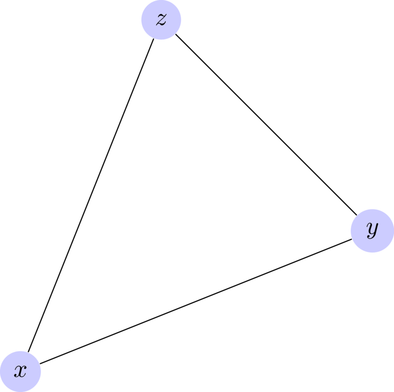

04 Best response polytopes
==========================

Corresponding chapters
----------------------

- `Best response polytopes <http://vknight.org/gt/chapters/06/>`_

Objectives
----------

- Define the best response polytopes (using both definitions: convex hull and
  halfspaces).
- Labelling of vertices
- Equivalence between equilibrium and fully labeled pair
- Vertex enumeration

Notes
-----

Defining best response polytopes
********************************

Discuss what an average is. Place this in the context of the line between two
points. Weighted averages of two points are just a line. So an average is just
a probability distribution.
Expand this notion to the average over **two points**. How would you take the
weighted average between three points :math:`x, y, z`:

.. math::

   \lambda_1 x + \lambda_2 x + \lambda_3 x

This corresponds to something like:

Explain how another definition for that space would be draw inequalities on
our variables.
Give definition of best response polytopes for a game. Illustrate this with
the battle of the sexes game (scaled!):

.. math::

   A = \begin{pmatrix}
   3 & 1\\
   0 & 2\\
   \end{pmatrix}
   \qquad
   B = \begin{pmatrix}
   2 & 1\\
   0 & 3\\
   \end{pmatrix}

**Go over the definition of the best response polytopes**.

The *row* best response polytope is given by:

.. math::

   \mathcal{P} = \left\{x\in\mathbb{R}^{m}\;|\;x\geq 0; xB\leq 1\right\}

This corresponds to the following inequalities:

- :math:`x_1\geq 0`
- :math:`x_2\geq 0`
- :math:`2x_1\leq 1`
- :math:`x_1+3x_2\leq 1`

From this we can identify the vertices:

- :math:`(x_1, x_2)=(0,0)`
- :math:`(x_1, x_2)=(1/2,0)`
- :math:`(x_1, x_2)=(0,1/3)`
- :math:`(x_1, x_2)=(1/2,1/6)`

This can be confirmed using :code:`nashpy`::

    >>> import numpy as np
    >>> import nash
    >>> B = np.array([[2, 1], [0, 3]])
    >>> halfspaces = nash.polytope.build_halfspaces(B.transpose())
    >>> for v, l in nash.polytope.non_trivial_vertices(halfspaces):
    ...     print(v)
    [ 0.5  0. ]
    [ 0.          0.333...]
    [ 0.5         0.166...]

The *column* best response polytope is given by:

.. math::

   \mathcal{Q} = \left\{y\in\mathbb{R}^{m}\;|\;Ay\leq 1; y\geq 0\right\}

This corresponds to the following inequalities:

- :math:`3y_1+y_2\leq 1`
- :math:`2y_2\leq 1`
- :math:`y_1\geq 0`
- :math:`y_2\geq 0`

From this we can identify the vertices:

- :math:`(y_1, y_2)=(0,0)`
- :math:`(y_1, y_2)=(1/3,0)`
- :math:`(y_1, y_2)=(0,1/2)`
- :math:`(y_1, y_2)=(1/6,1/2)`

Confirmed::

    >>> import numpy as np
    >>> import nash
    >>> A = np.array([[3, 1], [0, 2]])
    >>> halfspaces = nash.polytope.build_halfspaces(A)
    >>> for v, l in nash.polytope.non_trivial_vertices(halfspaces):
    ...     print(v)
    [ 0.333...  0.        ]
    [ 0.   0.5]
    [ 0.1666...  0.5       ]

Pair activity
*************

Ask everyone to draw these two polytopes.

Now describe how we label the vertices: **using the same ordering as the
inequalities** (starting at 0), a vertex has the label corresponding to that
inequality if it is a strict equality.

:math:`\mathcal{P}`:

.. image:: ../assets/activities/matching_pennies_row_best_response_polytope.png
   :width: 500px

:math:`\mathcal{Q}`:

.. image:: ../assets/activities/matching_pennies_col_best_response_polytope.png
   :width: 500px

Explain that what these polytopes represent is the scaled strategies when
players maximum utilities are 1. So given, the action of an opponent, if the
players' utility is 1 they are playing a best response.

Ask students to assign each other either :math:`\mathcal{P}` or
:math:`\mathcal{Q}`. Both players should choose a vertex and investigate the
utilities.

**For example, if:**

- The row player (:math:`\mathcal{P}`) picked: :math:`(0, 1/3)` with labels:
  :math:`\{0, 3\}`.
- The column player (:math:`\mathcal{Q}`) picked: :math:`(1/6, 1/2)` with
  labels: :math:`\{0, 1\}`.

This implies:

- The row player is **not** playing their first strategy (label 0), so playing
  their second strategy. Also (label 3), the best response to this is that the
  column player plays their second strategy.
- The best response to what the column player is currently doing is to play both
  strategies.

At this point the column player has an incentive to move, they will move to the
:math:`(0, 1/2)` vertex with labels: :math:`\{1, 2\}` which implies:

- The row player is as before.
- The column player is playing their first strategy (label 2). The best response
  to this is for the row player to play their second strategy (label 1).

So this is a Nash equilibria.

**Another example:**

- The row player (:math:`\mathcal{P}`) picked: :math:`(1/2, 1/6)` with labels:
  :math:`\{2, 3\}`.
- The column player (:math:`\mathcal{Q}`) picked: :math:`(1/6, 1/2)` with
  labels: :math:`\{0, 1\}`.

This implies:

- The best response to what the row player is currently doing is to play both
  strategies.
- The best response to what the column player is currently doing is to play both
  strategies.

Neither player has a reason to move.

**Another example:**

- The row player (:math:`\mathcal{P}`) picked: :math:`(0, 1/3)` with labels:
  :math:`\{0, 3\}`.
- The column player (:math:`\mathcal{Q}`) picked: :math:`(1/3, 0)` with
  labels: :math:`\{0, 3\}`.

This implies:

- The row player is **not** playing their first strategy (label 0), so playing
  their second strategy. Also (label 3), the best response to this is that the
  column player plays their second strategy.
- The column player is **not** playing their second strategy (label 3), so playing
  their first strategy. Also (label 0), the best response to this is that the
  row player plays their first strategy.

Neither player is happy here. Once one moves (not allowing the origin because
that's not playing) we arrive at a similar situation to before.

**After students have walked through this themselves have a discussion about
what property seems to indicate Nash equilibrium.** Move to discussing the
notes.

In particular highlight that we've scaled the utility so we need to (at the end)
scale the vertices too!

Finally show how this is implemented in :code:`nashpy`::

    >>> A = np.array([[1, -1], [-1, 1]])
    >>> matching_pennies = nash.Game(A)
    >>> for eq in matching_pennies.vertex_enumeration():
    ...     print(eq)
    (array([ 0.5,  0.5]), array([ 0.5,  0.5]))
