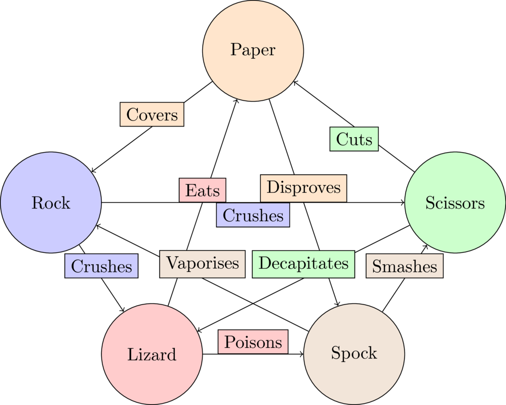

04 Support enumeration
======================

Corresponding chapters
----------------------

- `Support enumeration <http://vknight.org/gt/chapters/05/>`_

**Duration**: 100 minutes

Objectives
----------

- Define of support of a strategy
- Define nondegenerate games
- Describe and use suport enumeration

Notes
-----

Play a knockout RPSLS tournament
********************************

Tell students to create groups of 4 or 8 and play a knockout RPSLS tournament.

Explain rules and show:

Following the tournaments: have discussion about how winner won etc...

Explain that we will study this game using Game Theory:

.. math::

   A = \begin{pmatrix}
   0 & -1 & 1 & 1 & -1\\
   1 & 0 & -1 & -1 & 1\\
   -1 & 1 & 0 & 1 & -1\\
   -1 & 1 & -1 & 0 & 1\\
   1 & -1 & 1 & -1 & 0\\
   \end{pmatrix}

Then go over chapter 5:

- Define support of a strategy (relate to tournament previously played). For
  example the strategy :math:`(0, 1/2, 0, 0, 1/2)` has support :math:`\{2,
  5\}`::

      >>> import numpy as np
      >>> sigma = np.array([0, 1/2, 0, 0, 1/2])
      >>> np.where(sigma > 0)
      (array([1, 4]),)

- Discuss non degenerate games and show how RPSLS is in fact a degenerate game::

      >>> A = np.array([[0, -1, 1, 1, -1],
      ...               [1, 0, -1, -1, 1],
      ...               [-1, 1, 0, 1, -1],
      ...               [-1, 1, -1, 0, 1],
      ...               [1, -1, 1, -1, 0]])
      >>> sigma_c = np.array([1, 0, 0, 0, 0])
      >>> np.dot(A, sigma_c)  # Two element give max
      array([ 0,  1, -1, -1,  1])

- Discuss support enumeration algorithm. Theoretically could be used for RPSLS
  but would need to consider supports of unequal size. For the purpose of the
  illustration consider RPS:

  .. math::

     A = \begin{pmatrix}
     0 & -1 & 1\\
     1 & 0 & -1\\
     -1 & 1 & 0\\
     \end{pmatrix}

Apply the algorithm.

1. We see there are no pairs of best response, so consider :math:`k\in\{2,3\}`.
2. We have the following set of utilities to consider:

   1. :math:`I=\{1, 2\}`
       1. :math:`J=\{1, 2\}`
       2. :math:`J=\{1, 3\}`
       3. :math:`J=\{2, 3\}`
   2. :math:`I=\{1, 3\}`
       1. :math:`J=\{1, 2\}`
       2. :math:`J=\{1, 3\}`
       3. :math:`J=\{2, 3\}`
   3. :math:`I=\{2, 3\}`
       1. :math:`J=\{1, 2\}`
       2. :math:`J=\{1, 3\}`
       3. :math:`J=\{2, 3\}`
   4. :math:`I=J=\{1, 2, 3\}`

3. Now we consider (some not all as they are mainly the same) of the
   corresponding linear equations.

   1. :math:`I=\{1, 2\}`
       1. :math:`J=\{1, 2\}`

          .. math::

             \begin{align*}
             0{\sigma_r}_1 - {\sigma_r}_2 &= {\sigma_r}_1 + 0{\sigma_r}_2\\
             - {\sigma_r}_2 &= {\sigma_r}_1
             \end{align*}

          .. math::

             \begin{align*}
             0{\sigma_c}_1 - {\sigma_c}_2 &= {\sigma_c}_1 + 0{\sigma_c}_2\\
             {\sigma_c}_1 &= -{\sigma_c}_2
             \end{align*}

       2. :math:`J=\{1, 3\}`

          .. math::

             \begin{align*}
             0{\sigma_r}_1 - {\sigma_r}_2 &= -{\sigma_r}_1 + {\sigma_r}_2\\
             {\sigma_r}_1 &= 2{\sigma_r}_2
             \end{align*}

          .. math::

             \begin{align*}
             0{\sigma_c}_1 + {\sigma_c}_3 &= {\sigma_c}_1 - {\sigma_c}_3\\
             {\sigma_c}_1 &= 2{\sigma_c}_3
             \end{align*}

       2. :math:`J=\{2, 3\}`

          .. math::

             \begin{align*}
             {\sigma_r}_1 + 0{\sigma_r}_2 &= -{\sigma_r}_1 + {\sigma_r}_2\\
             2{\sigma_r}_1 &= {\sigma_r}_2
             \end{align*}

          .. math::
             \begin{align*}
             -{\sigma_c}_2 + {\sigma_c}_3 &= 0{\sigma_c}_2 - {\sigma_c}_3\\
             {\sigma_c}_2 &= 2{\sigma_c}_3
             \end{align*}

   2. :math:`I=\{1, 3\}` Similarly.
   3. :math:`I=\{2, 3\}` Similarly.
   4. :math:`I=J=\{1, 2, 3\}`

      In this case we have:

      .. math::

         \begin{align*}
         -{\sigma_r}_2 + {\sigma_r}_3 &= {\sigma_r}_1 - {\sigma_r}_3\\
         {\sigma_r}_1 - {\sigma_r}_3 &= -{\sigma_r}_1 + {\sigma_r}_2\\
         \end{align*}

      which has solution:

      .. math::

         {\sigma_r}_1 = {\sigma_r}_2 = {\sigma_r}_3

      Similarly:

      .. math::

         \begin{align*}
         -{\sigma_c}_2 + {\sigma_c}_3 &= {\sigma_c}_1 - {\sigma_c}_3\\
         {\sigma_c}_1 - {\sigma_c}_3 &= -{\sigma_c}_1 + {\sigma_c}_2\\
         \end{align*}

      which has solution:

      .. math::

         {\sigma_c}_1 = {\sigma_c}_2 = {\sigma_c}_3

4. Now we consider which of those supports give valid mixed strategies:

   1. :math:`I=\{1, 2\}`
       1. :math:`J=\{1, 2\}`

          .. math::

             \sigma_{r} = (k, -k, 0)

          which is not possible

       2. :math:`J=\{1, 3\}`

          .. math::

             \begin{align*}
             {\sigma_r} &= (2/3, 1/3, 0)\\
             {\sigma_c} &= (2/3, 0, 1/3)
             \end{align*}

       3. :math:`J=\{2, 3\}`

          .. math::

             \begin{align*}
             {\sigma_r} &= (1/3, 2/3, 0)\\
             {\sigma_c} &= (0, 2/3, 1/3)
             \end{align*}

   2. :math:`I=\{1, 3\}` Similarly.
   3. :math:`I=\{2, 3\}` Similarly.
   4. :math:`I=J=\{1, 2, 3\}`

          .. math::

             \begin{align*}
             {\sigma_r} &= (1/3, 1/3, 1/3)\\
             {\sigma_c} &= (1/3, 1/3, 1/3)
             \end{align*}

5. The final step is to check the best response condition:

   1. :math:`I=\{1, 2\}`
       2. :math:`J=\{1, 3\}`

          .. math::

             A\sigma_c^T =  \begin{pmatrix}
                                1/3\\
                                1/3\\
                                -2/3\\
                            \end{pmatrix}

          Thus :math:`\sigma_r` is a best response to :math:`\sigma_c`.

          .. math::

             \sigma_rB =  (-1/3, 2/3, -1/3)

          Thus :math:`\sigma_c` is **not** a best response to :math:`\sigma_r`.

       3. :math:`J=\{2, 3\}`

          .. math::

             A\sigma_c^T =  \begin{pmatrix}
                                -1/3\\
                                -1/3\\
                                2/3\\
                            \end{pmatrix}

          Thus :math:`\sigma_r` is **not** a best response to :math:`\sigma_c`.

          .. math::

             \sigma_rB =  (-2/3, 1/3, 1/3)

          Thus :math:`\sigma_c` is a best response to :math:`\sigma_r`.

   2. :math:`I=\{1, 3\}` Similarly.
   3. :math:`I=\{2, 3\}` Similarly.
   4. :math:`I=J=\{1, 2, 3\}`

          .. math::

             A\sigma_c^T =  \begin{pmatrix}
                                0\\
                                0\\
                                0\\
                            \end{pmatrix}

          Thus :math:`\sigma_r` is a best response to :math:`\sigma_c`.

          .. math::

             \sigma_rB =  (0, 0, 0)

          Thus :math:`\sigma_c` is a best response to :math:`\sigma_r`.

We can confirm all of this using :code:`nashpy`::

    >>> import nashpy as nash
    >>> A = np.array([[0, -1, 1],
    ...               [1, 0, -1],
    ...               [-1, 1, 0]])
    >>> rps = nash.Game(A)
    >>> list(rps.support_enumeration())
    [(array([0.333..., 0.333..., 0.333...]), array([0.333..., 0.333..., 0.333...]))]

Note that it can be computationally expensive to find **all** equilibria however
:code:`nashpy` can be used to find **a** Nash equilibrium by finding the first
one::

    >>> next(rps.support_enumeration())
    (array([0.333..., 0.333..., 0.333...]), array([0.333..., 0.333..., 0.333...]))

Discuss Nash's theorem briefly. Highlight how that can seem contradictory for
the output of :code:`nashpy` (using support enumeration)
for the degenerate game of the notes. However, that won't always be the case::

      >>> A = np.array([[0, -1, 1, 1, -1],
      ...               [1, 0, -1, -1, 1],
      ...               [-1, 1, 0, 1, -1],
      ...               [-1, 1, -1, 0, 1],
      ...               [1, -1, 1, -1, 0]])
      >>> rpsls = nash.Game(A)
      >>> list(rpsls.support_enumeration())
      [(array([0.2, 0.2, 0.2, 0.2, 0.2]), array([0.2, 0.2, 0.2, 0.2, 0.2]))]

Some details about the proof:

- Proved in a 19 page thesis! (2 pages of appendices)
- Noble prize for economics
- Watch a beautiful mind
