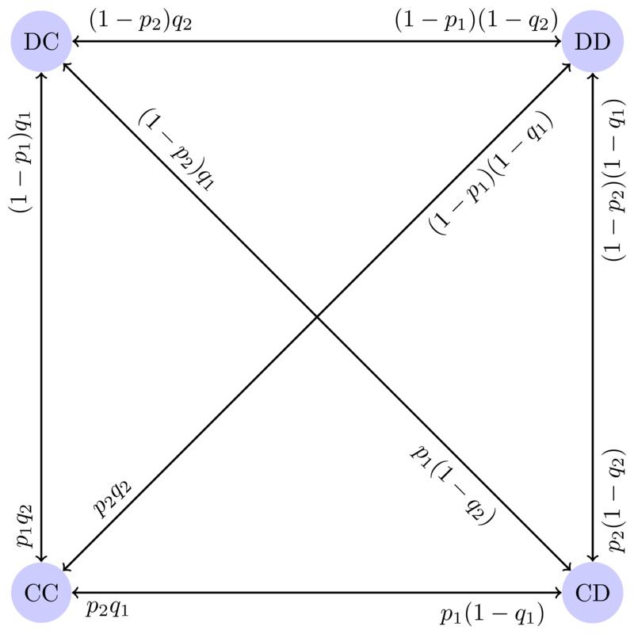

08 Prisoners Dilemma
====================

Corresponding chapters
----------------------

- `Prisoners Dilemma <http://vknight.org/gt/chapters/09/>`_

Objectives
----------

- Explore the Iterated Prisoners Dilemma

Notes
-----

Playing team based Iterated Prisoner's Dilemma
**********************************************

Show this video: https://www.youtube.com/watch?v=p3Uos2fzIJ0

Ask class to form in to groups of approximately 8: 4 teams of 2.

**Virtual modification:** Use breakout rooms of 8.

Write the following on the board:

+---------+------------------+-------------------------------+-------------------------------+
|  Name   | Score vs 1st opp | :math:`\sum` score vs 2nd opp | :math:`\sum` score vs 3rd opp |
+=========+==================+===============================+===============================+
|         |                  |                               |                               |
+---------+------------------+-------------------------------+-------------------------------+
|         |                  |                               |                               |
+---------+------------------+-------------------------------+-------------------------------+
|         |                  |                               |                               |
+---------+------------------+-------------------------------+-------------------------------+
|         |                  |                               |                               |
+---------+------------------+-------------------------------+-------------------------------+

Explain that teams will play the iterated Prisoners dilemma:

.. math::

   A =
   \begin{pmatrix}
       3 & 0\\
       5 & 1
   \end{pmatrix}\qquad
   B =
   \begin{pmatrix}
       3 & 5\\
       0 & 1
   \end{pmatrix}

Discuss NE of stage game.

Discuss "Cooperation" versus "Defection" and explain that goal is to maximise
overall score (not necessarily beat direct opponent).

For every dual write the following on the board (assuming 8 turns):

+---------+-------+--------------------+--------------------+--------------------+---------------------+--------------------+--------------------+-------------------+
|  Name   | Score | :math:`\sum` score | :math:`\sum` score | :math:`\sum` score |  :math:`\sum` score | :math:`\sum` score | :math:`\sum` score |:math:`\sum` score |
+=========+=======+====================+====================+====================+=====================+====================+====================+===================+
|         |       |                    |                    |                    |                     |                    |                    |                   |
+---------+-------+--------------------+--------------------+--------------------+---------------------+--------------------+--------------------+-------------------+
|         |       |                    |                    |                    |                     |                    |                    |                   |
+---------+-------+--------------------+--------------------+--------------------+---------------------+--------------------+--------------------+-------------------+

Instructions for a dual:

- Give all teams copies of a :download:`document to help record <../assets/activities/pd_tournament/main.pdf>`.
- Think about strategy.
- Before every stage invite both individuals to talk to each other.
- Get teams to "face away", after a count down "show" (either a C or a D).

After the tournament:

- Discuss winning strategy and other interesting strategies.
  Discuss potential coalitions that arose.
- Discuss how teams had more information that usual.
- Invite the possibility of modifications (prob end, noise and lack of information).

**Consider Reactive strategies**

Go over theory.

In the case of :math:`(p_1, q_1)=(1 / 4, 4 / 5)` and
:math:`(p_2, q_2)=(2 / 5, 1 / 3)` we have:

.. math::
   r_1=\frac{11}{20}\qquad r_2=\frac{1}{15}

.. math::
   s_1 = \frac{185}{311}\qquad s_2 = \frac{116}{311}

The steady state probabilities are given by:

.. math::

   \pi = (21460/96721, 36075/96721, 14616/96721, 24570/96721)

Here is some sympy code to illustrate this::

    >>> import sympy as sym
    >>> p_1, p_2 = sym.S(1) / sym.S(4), sym.S(4) / sym.S(5)
    >>> q_1, q_2 = sym.S(2) / sym.S(5), sym.S(1) / sym.S(3)
    >>> r_1 = p_1 - p_2
    >>> r_2 = q_1 - q_2
    >>> r_1, r_2
    (-11/20, 1/15)
    >>> s_1 = (q_2 * r_1 + p_2) / (1 - r_1 * r_2)
    >>> s_2 = (p_2 * r_2 + q_2) / (1 - r_1 * r_2)
    >>> s_1, s_2
    (185/311, 116/311)
    >>> pi = sym.Matrix([[s_1 * s_2, s_1 * (1 - s_2), (1 - s_1) * s_2, (1 - s_1) * (1 - s_2)]])
    >>> pi
    Matrix([[21460/96721, 36075/96721, 14616/96721, 24570/96721]])

We can verify that this is a steady state vector:

.. math::

   M =
   \begin{pmatrix}
       1/10 & 3/20  & 3/10 & 9/20\\
       8/25 & 12/25 & 2/25 & 3/25\\
       1/12 & 1/6   & 1/4  & 1/2\\
       4/15 & 8/15  & 1/15 & 2/15\\
   \end{pmatrix}

   \pi M = (21460/96721, 36075/96721, 14616/96721, 24570/96721)

Sympy code::

    >>> M = sym.Matrix([[p_1*q_1, p_1*(1-q_1), (1-p_1)*q_1, (1-p_1)*(1-q_1)],
    ...                 [p_2 * q_1, p_2 * (1-q_1), (1-p_2) * q_1,  (1-p_2) * (1-q_1)],
    ...                 [p_1 * q_2, p_1 * (1-q_2),  (1-p_1) * q_2, (1-p_1) * (1-q_2)],
    ...                 [p_2 * q_2, p_2 * (1-q_2), (1-p_2) * q_2, (1-p_2)*(1-q_2)]])
    >>> M
    Matrix([
    [1/10,  3/20, 3/10, 9/20],
    [8/25, 12/25, 2/25, 3/25],
    [1/12,   1/6,  1/4,  1/2],
    [4/15,  8/15, 1/15, 2/15]])
    >>> pi * M
    Matrix([[21460/96721, 36075/96721, 14616/96721, 24570/96721]])
    >>> pi * M == pi
    True

The utility is then given by:

.. math::
   3s_1s_2 + 0s_1(1-s_2) + 5(1-s_1)s_2 + (1-s_1)(1-s_2) = 162030/96721\approx1.675

Sympy code::

    >>> rstp = sym.Matrix([[sym.S(3), sym.S(0), sym.S(5), sym.S(1)]])
    >>> score = pi.dot(rstp)
    >>> score, float(score)
    (162030/96721, 1.675...)
