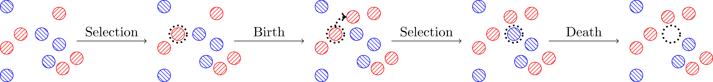

11 Moran Processes
==================

**Duration**: 140 minutes

Corresponding chapters
----------------------

- `Moran Processes <http://vknight.org/gt/chapters/12/>`_

Objectives
----------

- Play a class activity of a Moran process;
- Define a Moran process;
- Prove theorem for formula of fixation probabilities;
- Numeric calculations.

Activity
--------

Use :download:`moran process
form<../assets/activities/moran_process/main.pdf>` have students play in pairs.

**Also requires use of dice, allowing for multiples of 4 and 6**. For example:

- 1 D12 (12 sided dice) or;
- 1 D6 and 1 D4 (the example used in this page);
- 1 D6 and 1 D8.

**Virtual modification:** Use breakout rooms of 4. For dice show how to use the
Python random library. 

Explain that we will aim to reproduce a Moran process with :math:`N=3`.

We will do this with the Hawk-Dove game:

.. math::

   A = \begin{pmatrix}
       0 & 3\\
       1 & 2
   \end{pmatrix}

Recall, this corresponds to sharing of 4 resources:

- Two hawks both get nothing;
- A hawk meeting a dove gets 3 out of 4.
- A dove meeting a hawk gets 1 out of 4.
- A dove meeting a dove gets 2 out of 4.

Give students 5 minutes to write out the fitnesses of each type in each possible
situation.

Confirm:

+------------------+----------------------------------+----------------------------------+
|                  | :math:`f(\text{Hawk})`           | :math:`f(\text{Dove})`           |
+==================+==================================+==================================+
| 1 Hawk, 2 Doves  |  :math:`0\times 0 + 2\times 3=6` |  :math:`1\times 1 + 1\times 2=3` |
+------------------+----------------------------------+----------------------------------+
| 2 Hawks, 1 Dove  |  :math:`1\times 0 + 1\times 3=3` |  :math:`2\times 1 + 0\times 2=2` |
+------------------+----------------------------------+----------------------------------+

Give students 5 minutes to write out the probabilities of selection of each type
in each possible situation.

Confirm:

+-----------------+---------+------------------------------------------+--------------------------+
|                 | Select  | Selection: Birth                         | Selection: Death         |
+=================+=========+==========================================+==========================+
| 1 Hawk, 2 Doves | Hawk    |  :math:`\frac{6}{6+2\times 3}`           |  :math:`\frac{1}{3}`     |
+-----------------+---------+------------------------------------------+--------------------------+
| 1 Hawk, 2 Doves | Dove    |  :math:`\frac{2\times 3}{6+2\times 3}`   |  :math:`\frac{2}{3}`     |
+-----------------+---------+------------------------------------------+--------------------------+
| 2 Hawks, 1 Dove | Hawk    |  :math:`\frac{2\times 3}{2\times 3+2}`   |  :math:`\frac{2}{3}`     |
+-----------------+---------+------------------------------------------+--------------------------+
| 2 Hawks, 1 Dove | Dove    |  :math:`\frac{2}{2\times 3+2}`           |  :math:`\frac{1}{3}`     |
+-----------------+---------+------------------------------------------+--------------------------+

Give students 5 minutes to identify what sided dice and what values will allow
them to simulate the process of selecting birth/death individuals.

Confirm:

+---------+------------------+-------------------------------+--------------------+-------------------------+
| State   | Birth: dice used | Select Hawk values            | Death: dice used   | Select Hawk values      |
+=========+==================+===============================+====================+=========================+
| 1 Hawk  |  6               |  :math:`\{1, 2, 3\}`          | 6                  |  :math:`\{1, 2\}`       |
+---------+------------------+-------------------------------+--------------------+-------------------------+
| 2 Hawks |  4               |  :math:`\{1, 2, 3\}`          | 6                  |  :math:`\{1, 2, 3, 4\}` |
+---------+------------------+-------------------------------+--------------------+-------------------------+

Hand out a dice to each group (ideally a D6 and a D4 to each group but perhaps
they can identify other ways).

**Let students simulate**

Count from groups to obtain mean fixation rate of a Hawk.

Show the following code that allows us to simulate the simulation undertaken by
the students (this is not the same code as in the notes)::

    >>> import collections
    >>> import matplotlib.pyplot as plt
    >>> import numpy as np
    >>> import tqdm

    >>> def roll_n_sided_dice(n=6):
    ...     """
    ...     Roll a dice with n sides.
    ...     """
    ...     return np.random.randint(1, n + 1)

    >>> class MoranProcess:
    ...     """
    ...     A class for a moran process with a population of
    ...     size N=3 using the standard Hawk-Dove Game:
    ...
    ...     A =
    ...        [0, 3]
    ...        [1, 2]
    ...
    ...     Note that this is a simulation corresponding to an
    ...     in class activity where students roll dice.
    ...     """
    ...     def __init__(self, number_of_hawks=1, seed=None):
    ...
    ...         if seed is not None:
    ...             np.random.seed(seed)
    ...
    ...         self.number_of_hawks = number_of_hawks
    ...         self.number_of_doves = 3 - number_of_hawks
    ...
    ...         self.dice_and_values_for_hawk_birth = {1: (6, {1, 2, 3}), 2: (4, {1, 2, 3})}
    ...         self.dice_and_values_for_hawk_death = {1: (6, {1, 2}), 2: (6, {1, 2, 3, 4})}
    ...
    ...         self.history = [(self.number_of_hawks, self.number_of_doves)]
    ...
    ...     def step(self):
    ...         """
    ...         Select a hawk or a dove for birth.
    ...         Select a hawk or a dove for death.
    ...
    ...         Update history and states.
    ...         """
    ...         birth_dice, birth_values = self.dice_and_values_for_hawk_birth[self.number_of_hawks]
    ...         death_dice, death_values = self.dice_and_values_for_hawk_death[self.number_of_hawks]
    ...
    ...         select_hawk_for_birth = self.roll_dice_for_selection(dice=birth_dice, values=birth_values)
    ...         select_hawk_for_death = self.roll_dice_for_selection(dice=death_dice, values=death_values)
    ...
    ...         if select_hawk_for_birth:
    ...             self.number_of_hawks += 1
    ...         else:
    ...             self.number_of_doves += 1
    ...
    ...         if select_hawk_for_death:
    ...             self.number_of_hawks -= 1
    ...         else:
    ...             self.number_of_doves -= 1
    ...
    ...         self.history.append((self.number_of_hawks, self.number_of_doves))
    ...
    ...     def roll_dice_for_selection(self, dice, values):
    ...         """
    ...         Given a dice and values return if the random roll is in the values.
    ...         """
    ...         return roll_n_sided_dice(n=dice) in values
    ...
    ...     def simulate(self):
    ...         """
    ...         Run the entire simulation: repeatedly step through
    ...         until the number of hawks is either 0 or 3.
    ...         """
    ...         while self.number_of_hawks in [1, 2]:
    ...             self.step()
    ...         return self.number_of_hawks
    ...
    ...     def __len__(self):
    ...         return len(self.history)

This carries out the simulations::

    >>> repetitions = 10 ** 5
    >>> end_states = []
    >>> path_lengths = []
    >>> for seed in range(repetitions):
    ...     mp = MoranProcess(seed=seed)
    ...     end_states.append(mp.simulate())
    ...     path_lengths.append(len(mp))
    >>> counts = collections.Counter(end_states)
    >>> counts[3] / repetitions
    0.54666

Discuss obtaining theoretic probabilities of changing state:

.. math::
   p_{10}=\frac{6}{12}\frac{1}{3}=\frac{1}{6}\qquad
   p_{12}=\frac{6}{12}\frac{2}{3}=\frac{1}{3}\qquad
   p_{21}=\frac{2}{8}\frac{2}{3}=\frac{1}{6}\qquad
   p_{23}=\frac{6}{8}\frac{1}{3}=\frac{1}{4}

**Now work through the notes: culminating in the proof of the theorem for the
absorption probabilities of a birth death process.**

Discuss and use code from chapter to show the fixation with the Hawk Dove game::

    >>> A = np.array([[0, 3], [1, 2]])

Calculate theoretic value using formula from theorem:

.. math::

   \begin{align*}
       f_{1i} &= \frac{3(N-i)}{N - 1}=3\frac{N-i}{N-1}\\
       f_{2i} &= \frac{i+2(N - i -1)}{N - 1}=\frac{2N-2-i}{N - 1}\\
   \end{align*}

This gives (for :math:`N=3`):

+------------------+--------------+--------------+
|                  | :math:`i=1`  | :math:`i=2`  |
+==================+==============+==============+
| :math:`f_{1i}`   |      3       |       3/2    |
+------------------+--------------+--------------+
| :math:`f_{2i}`   |      3/2     |       1      |
+------------------+--------------+--------------+
| :math:`\gamma_i` |      1/2     |       2/3    |
+------------------+--------------+--------------+

Thus:

.. math::

   x_1 = \frac{1}{1 + 1/2 + 1/2\times2/3}=\frac{1}{11/6}\approx.545455

- Discuss work of Maynard smith but that this actually used Hawk Dove game in
  infinite population games.
- Discussion possibility for using a utility model on top of fitness.
- A lot of current work looks at Moran processes: a good model of invasion of a
  specifies etc...
- The Prisoners dilemma can also be included, there is documentation about
  simulating this with Axelrod is here:
  http://axelrod.readthedocs.io/en/stable/tutorials/getting_started/moran.html
