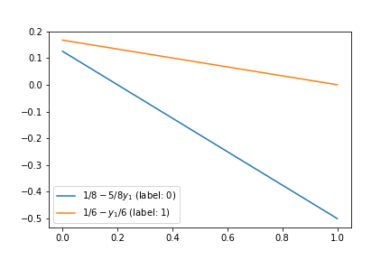
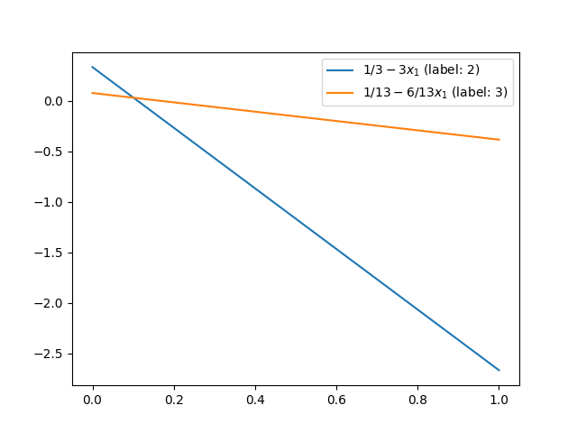

AA- Revisiting Polytopes
========================

Corresponding chapters
----------------------

- `Best response polytopes <https://vknight.org/gt/chapters/06/>`_

**Duration**: 50 minutes

Objectives
----------

- Re visit best response polytopes using a game with a dominated strategy.

Notes
-----

Consider the :math:`(A,B)\in{\mathbb{R}^{2\times 2}}^2` game:

.. math::

   A = \begin{pmatrix}
   1 & 4 \\
   -3 & 2
   \end{pmatrix}
   \qquad
   B = \begin{pmatrix}
   5 & 2 \\
   -1 & 9
   \end{pmatrix}

**Ask students in pairs to construct the column player best response polytope**

First we add :math:`4` to all elements to ensure they are positive:

.. math::

   A = \begin{pmatrix}
   5 & 8 \\
   1 & 6
   \end{pmatrix}
   \qquad
   B = \begin{pmatrix}
   9 & 6 \\
   3 & 13
   \end{pmatrix}

By definition
(https://vknight.org/gt/chapters/06/#Definition-of-best-response-polytopes), the
column player best response polytope :math:`\mathcal{Q}` is given by:

.. math::

   \mathcal{Q} = \{y\in\mathbb{R}^{n}\;|\;Ay\leq 1\;y\geq0\}

So the inequalities are:

.. math::

   \begin{align*}
   5y_1+8y_2&\leq 1&&\text{ label: }0\\
   y_1 + 6y_2&\leq 1&&\text{ label: }1\\
   y_1&\geq 0&&\text{ label: }2\\
   y_2&\geq 0&&\text{ label: }3
   \end{align*}

The first two inequalities come from :math:`Ay\leq 1`, however, :math:`Ay`
corresponds to the row players utility against **vertex** :math:`y`. 

Note that
everything is scaled so that the best response of the row player is :math:`1`
(the scaling takes place in the strategies/vertices).

**Thus** if a vertex has label :math:`0` or :math:`1` that implies that the
first/second row player strategy is a best response to :math:`y`.

**We will return to this idea** but first let us plot our :math:`Q`. We start by
rearranging our inequalities:

.. math::

   \begin{align*}
   y_2 &\leq 1/8 - 5/8y_1&&\text{ label: }0\\
   y_2 &\leq 1/6 - y_1/6&&\text{ label: }1\\
   y_1&\geq 0&&\text{ label: }2\\
   y_2&\geq 0&&\text{ label: }3
   \end{align*}

Now let us sketch these::

    import matplotlib.pyplot as plt
    %matplotlib inline
    y1s = [0, 1]
    first_line = [1 / 8 - 5 / 8 * y for y in y1s]
    second_line = [1 / 6 - y / 6 for y in y1s]
    plt.figure()
    plt.plot(first_line, label="$1/8-5/8y_1$ (label: 0)")
    plt.plot(second_line, label="$1/6-y_1/6$ (label: 1)")
    plt.legend();

This gives:

We can see that our polytope is a straightforward triangle and that no vertex
will ever have label :math:`1`.

**Discuss if this is OK?**

Returning to the game:

.. math::
   A = \begin{pmatrix}
   \underline{5} & \underline{8} \\
   1 & 6
   \end{pmatrix}

We see that the first strategy dominates the second: so the second strategy **is
never** a best response.

Our vertices with labels are:

.. math::

   \begin{align*}
   (0, 0)&\text{ labels }\{2, 3\}\\
   (0, 1/8)&\text{ labels }\{0, 2\}\\
   (1/5, 0)&\text{ labels }\{0, 3\}\\
   \end{align*}

**Exercise:**

Obtain the best response polytope for the row player:

By definition
(https://vknight.org/gt/chapters/06/#Definition-of-best-response-polytopes), the
row player best response polytope :math:`\mathcal{P}` is given by:

.. math::

   \mathcal{Q} = \{x\in\mathbb{R}^{m}\;|\;x\geq0\;xB\leq 1\}

So the inequalities are:

.. math::

   \begin{align*}
   x_1&\geq 0&&\text{ label: }0\\
   x_2&\geq 0&&\text{ label: }1\\
   9x_1+3x_2&\leq 1&&\text{ label: }2\\
   2x_1 + 9x_2&\leq 1&&\text{ label: }3
   \end{align*}

Rearranging:

.. math::

   \begin{align*}
   x_1&\geq 0&&\text{ label: }0\\
   x_2&\geq 0&&\text{ label: }1\\
   x_2&\leq 1/3 - 3 x_1&&\text{ label: }2\\
   x_2&\leq 1/9 - 2/9x_1&&\text{ label: }3
   \end{align*}

Now let us sketch these::

    x1s = [0, 1]
    first_line = [1 / 3 - 3 * x for x in x1s]
    second_line = [1 / 9 - 2 / 9 * x for x in x1s]
    plt.figure()
    plt.plot(first_line, label="$1/3-3x_1$ (label: 2)")
    plt.plot(second_line, label="$1/9-2/9x_1/6$ (label: 3)")
    plt.legend();

This gives:

We see that there our polytope has 4 vertices:

.. math::

   \begin{align*}
   (0, 0)&\text{ labels }\{0, 1\}\\
   (0, 1/9)&\text{ labels }\{0, 3\}\\
   (1/9, 0)&\text{ labels }\{1, 2\}\\
   (2/25, 7/75)&\text{ labels }\{2, 3\}\\
   \end{align*}

Here is some sympy code to verify the intersection of both boundaries::

   >>> import sympy as sym
   >>> x = sym.Symbol("x")
   >>> sym.solveset(sym.S(1) / 3-3 * x - sym.S(1) / 9 + sym.S(2) / 9 * x, x)
   {2/25}

We can now identify a fully labelled vertex pair (we already know that label
:math:`code` must come from a vertex in :math:`\mathcal{P}`):

.. math::

   ((1/9, 0), (1/5, 0))

Which once normalised gives: :math:`((1, 0),(0, 1))` which is in fact readily
readable using pure best responses:

.. math::

   A = \begin{pmatrix}
   \underline{1} & \underline{4} \\
   -3 & 2
   \end{pmatrix}
   \qquad
   B = \begin{pmatrix}
   \underline{5} & 2 \\
   -1 & \underline{9}
   \end{pmatrix}

Checking using :code:`nashpy`::

    >>> import nashpy as nash
    >>> A = [[1, 4], [-3, 2]]
    >>> B = [[5, 2], [-1, 9]]
    >>> game = nash.Game(A, B)
    >>> list(game.vertex_enumeration())
    [(array([1., 0.]), array([1., 0.]))]
